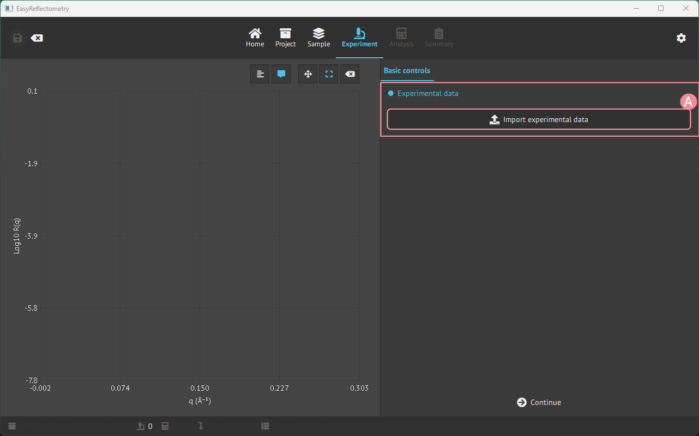
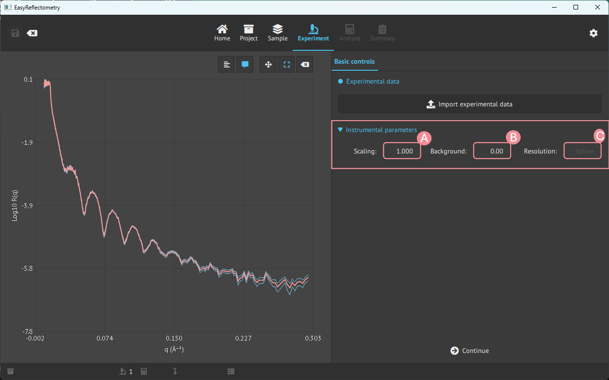

# Loading experimental data
## Load data
Experimental data must be **.dat**, **.txt**, or **.ort** to be loaded into the EasyReflectometryApp.  
Data is loaded in the `Experimental` page, by pressing the `Import experimental data`.

- **A**: Open your file manager to load data in the mentioned format.

Each selected file becomes its own experiment. A file with a fourth column (the q-resolution,
sQz) gives the experiment a point-by-point resolution that the fit uses for that experiment.

## Several curves for one contrast
A contrast is often measured as several curves, one per incident angle or wavelength band,
each with its own resolution. Select the experiment and press
`Add curve(s) to current experiment` to merge further files into it: the points are
combined (sorted by q) and every point keeps the resolution it was measured with. The
experiment keeps its name and model. Polarised experiments cannot be extended this way, and
a file holding several datasets is refused.

## Instrumental parameters  
When data is loaded, it is possible to change instrumental parameters that affect the data.

- **A**: Scale the data by the given value.
- **B**: Set the level where data merges into the experimental background.
- **C**: Instrumental resolution that percentage varies as a function of Q.

## Polarised data
A measurement that recorded several spin channels is loaded with the second button,
`Load polarized experiment (file per channel)`, which takes one file per channel and asks
how to assign them. See [polarised data](./polarized_data.md).
